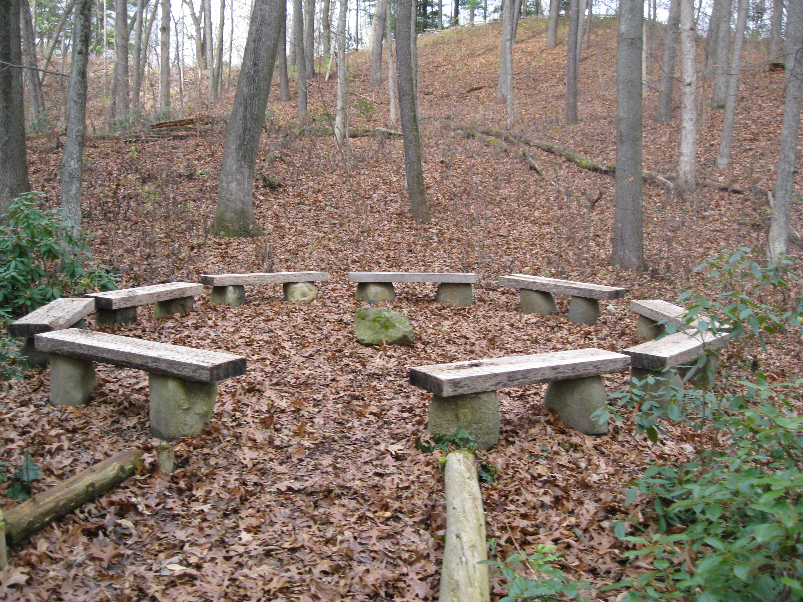

Teaching My Younger Self				

 
February 1st ,2018

Design a curriculum for your young self, High School sophomore.

I would like to first state that I think that the basic premise that I can teach my younger self is flawed. Is not part of who I am, formed by how I was taught and therefore bias me in setting out a curriculum for myself?  Do I want to change or influence who I have become? Is my intention to correct what I don't like or how I learn and would have liked to do it differently, a do-over?  I see myself as a 'Jack of all Trades, Master of None' and believe this was molded by my education and who I am and what I took away from it. Am I formed or informed by my younger self.

At the time I was a sophomore (Junior high school in Canada) it was the next wave of experiment schooling. I was taught in both a traditional classroom education with desks set in rows, teachers at the front of the room, textbooks, memory work, black boards as well as a more open experimental environment that broke those rules. My chemistry teacher taught in the traditional classroom with school supplied text books, memorizing and frequent testing. He was good at teaching that way and I got a solid foundation. I had a social studies teacher that intentionally worked outside of the traditional classroom and taught in a way that was very exciting and stimulating and made connections between learning and the real world. I also had a physics teacher that straddled both the traditional classroom and experimental learning by combining a solid foundation and making connections with the real world. He taught both inside and outside the classroom, taught in an interdisciplinary way and helped me learn by connecting the text book to the cause and effect of the environment around me. 
Setting out a curriculum for my younger self, structure is very important and to have a foundation, clear perameters, discipline and direction. At the same time and equally important is a curriculum that gives freedom to explore and the environment to teach it in. As a sophomore, as mentioned in class, this is the time of transition from a child to an adult. This is a no man's land between having the fundamentals of an education and the freedom to interpret it. There is a phrase that is something like, 'You can't abstract the flower until you can copy the flower then you can paint the real flower'. I think that you can't really explore without having the tools to guide you.

Setting out a good curriculum for myself would combine the solid foundation of a traditional education with the experimentation and exploration of a freer environment. I don't think these are mutually exclusive but count on a teacher to be a disciplined and creative thinker. There needs to be a flexibility in the curriculum to adapt to the needs of the student.
